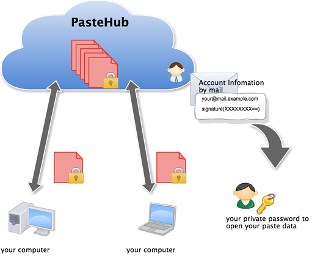

PasteHub
=======================

## Concept

Cross-platform clipboard (copy and paste) sync tool.

## Support OS

   type        | OS's clipboard |   Emacs kill-ring  |    vim    |
---------------|----------------|--------------------|-----------|
MacOSX(gem)    |        OK      |         OK         |    OK     |
Windows(gem)   |        OK      |      not yet       |  not yet  |
Linux(gem)     |      not yet   |         OK         |    OK     |

## How to install

+ [Dropbox](./doc/client/dropbox.md)
+ [RubyGems](./doc/client/ruby_gems.md)
+ [Setup Emacs](./doc/client/setup_emacs.md)
+ [Setup Vim](./doc/client/setup_vim.md)

## Open Source

This software is distributed under the BSD-style license.
