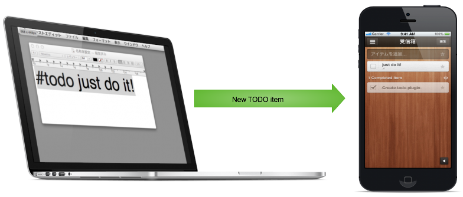
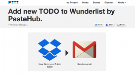
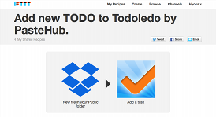

Plugins for PasteHub
=======================
PasteHub has plugin framework.
PasteHub plugin can hook to the arrival message from clipboard.

## Builtin plugins

----

### Todo-plugin

Todo-plugin cooperate with [IFTTT.com](http://ifttt.com "IFTTT").
If arrival clipboard message includes '#todo' keyword, Todo-plugin save the todo file to ~/Dropbox/Public/pastehub_todo/ directory.
  

The todo message can be registered to Wunderlist.com and Todoledo.com. by [IFTTT.com](http://ifttt.com "IFTTT").

### IFTTT [Wunderlist recipe](https://ifttt.com/recipes/156495-add-new-todo-to-wunderlist-by-pastehub "Wunderlist")
  

### IFTTT [Todoledo recipe](https://ifttt.com/recipes/156497-add-new-todo-to-todoledo-by-pastehub "Todoledo")
  

----

### SendMail-plugin

SendMail-plugin cooperate with UNIX mail command.
If arrival clipboard message includes specified tag, SendMail-plugin sends message by email.

#### setup

To enable SendMail-plugin, setup environment verialbes.
example:

    export PASTEHUB_MAIL0=tag1,mail_1@example.com
    export PASTEHUB_MAIL1=tag2,mail_2@example.com

If PasteHub detect the clipboard message " #tag1 message1 ", SendMail-plugin sends message to "mail_1@example.com" by email.

And clipboard message " #tag2 message2 " can be sent to "mail_2@example.com" by email.

#### cooperation with [Evernote](http://www.evernote.com "Evernote")

If you want to register a message to Evernote, setup environment variable like:

    export PASTEHUB_MAIL0=ever,YOUR_EVERNOTE_MAIL_ADDRESS

----
	

