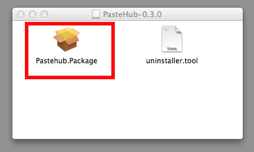
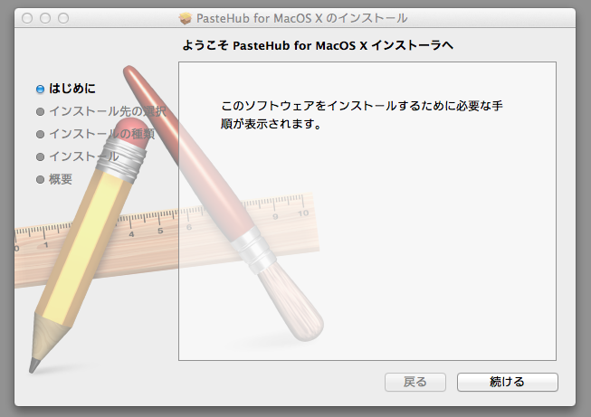
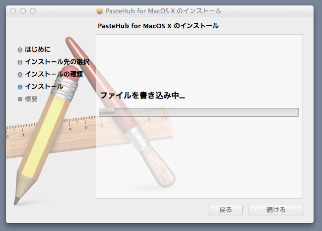
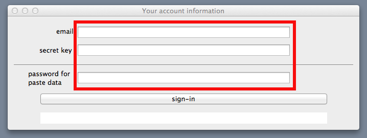
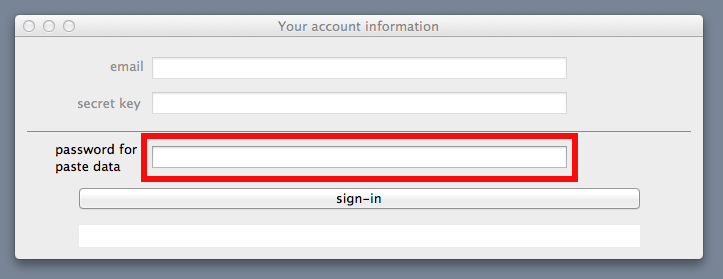

How to install client software (MacOS X)
=======================

## Required platform

- MacOS X 10.6 or later

## installation instruction

- download installer

      [PasteHub-0.3.0.dmg](https://s3-ap-northeast-1.amazonaws.com/pastehub/release/MacOSX/PasteHub-0.3.0.dmg) (20MByte)

- Please open dmg file, then double click Pastehub.Package to install

      

     

     ... Please install PasteHub.app 

     

     ... Please install PasteHub.app 

- Double click to start PasteHub application
     

- setup your account information.

     Please input your account infromation ( how to get your account? ... see [Registration](Registration.md) )
     

     OK, ONLINE icon appears on status bar

     

## Copy and Paste operation

- It's easy.  please cut / copy / paste as usual.

     

     PasteHub.app sync automatically.

     

## How to start PasteHub application again.

- Double click to start PasteHub application

     

- please input your own password

     

     OK, ONLINE icon appears on status bar

      
  

## Status bar icons

+   ... offline
+  ... ONLINE
+  ... one   paste data comming
+  ... two   paste data comming
+  ... three paste data comming
+  ... over three paste data comming

## History

+ 0.3.0 First installer package version.
+ 0.2.4 Fixed SEGV problem with three environment variables for MacRuby. ( VM_DISABLE_RBO=1 /  VM_OPT_LEVEL=0 / AUTO_USE_TLC=0 )
+ 0.2.3 Fixed SEGV problem of gdbm parallel operation.
+ 0.2.2 First release.
