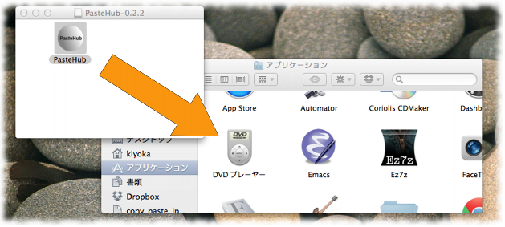

Install client software (MacOS X)
=======================

# Required platform

- MacOS X 10.6 or later

# installation instruction

- download application

  [PasteHub-0.2.2.dmg](https://s3-ap-northeast-1.amazonaws.com/pastehub/release/MacOSX/PasteHub-0.2.2.dmg) (9.7M)

- Please copy PasteHub.app to your Application Folder

   

- double click to start application

- input your account information

  input your acction infromation

  

  decide your own password

  

  ONLINE icon appears

  

# Copy and Paste operation

  It's easy.
  please cut / copy / paste as usual.
  PasteHub.app sync automatically.

  

# Status bar icons

+   ... offline
+  ... ONLINE
+  ... one   paste data comming
+  ... two   paste data comming
+  ... three paste data comming
+  ... over three paste data comming
