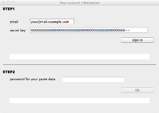

Install client software (MacOS X)
=======================

# Required platform

- MacOS X 10.6 or later

# installation instruction

- download application

  [PasteHub-0.2.2.dmg](https://s3-ap-northeast-1.amazonaws.com/pastehub/release/MacOSX/PasteHub-0.2.2.dmg) (9.7M)

- install to your Application Folder

   

- double click to start application

- input your account information

  

# Copy and Paste

  Command + C / Command + V

# Status bar icons

+   ... offline
+  ... ONLINE
+  ... one paste data comming

