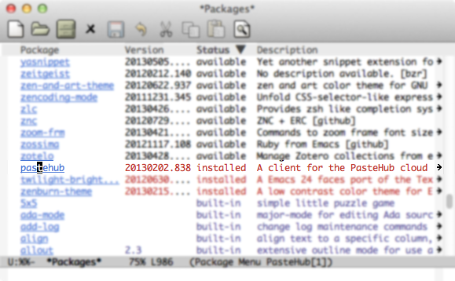

Install client software (Emacs)
=======================

## Required platforms

- Linux
- Emacs 24.1 or later

## installation instruction

### Setup melpa

add this code your .emacs

	(require 'package)
	(add-to-list 'package-archives
	            '("melpa" . "http://melpa.milkbox.net/packages/") t)
	(package-initialize)

### install the "pastehub" package from MELPA.

  

### and add this code to your .emacs

	(require 'pastehub)

  PasteHub's mode line appears 

  
